# Awesome-Cloud-Native-Relational-Database ☁️ 🗄️ 🚀

  

  
  
  
  
  
  

---

## 🌟 Top Cloud-Native Relational Database Ecosystem 🌐

**Curated List of Commercial Cloud Databases & Open-Source Distributed SQL Systems**  
*Focused on Serverless Postgres, Distributed SQL, HTAP Workloads, Multi-Region Replication & Self-Hosted Cloud-Native Databases* ⚡

**Last updated: October 2026** 📅

---

### 📌 Overview & Market Analysis 🔍

Welcome to the ultimate curated directory of **cloud-native relational database platforms**, **open-source distributed SQL systems**, and **serverless Postgres frameworks**. Whether you are looking for enterprise-grade commercial solutions (such as *Amazon Aurora*, *Google Cloud AlloyDB*, and *CockroachDB Cloud*), or self-hostable open-source alternatives (like *YugabyteDB*, *TiDB*, and *Neon*), this list covers category leaders, PostgreSQL compatibility, performance benchmarks, and privacy-respecting distributed data architectures.

**Key Market Context:**
- **PostgreSQL is the most portable relational engine** — available as a managed service on all major clouds with the strongest open-source ecosystem. 🐘
- **CockroachDB licensing shift** — source-available with commercial license, free for companies under $10M revenue with mandatory telemetry. 🪳
- **Neon (serverless Postgres) acquisition by Databricks** — signaling consolidation in serverless database infrastructure. ⚡

---

## 📑 Table of Contents

- [🏢 SaaS & Commercial Platforms](#-saas--commercial-platforms)
- [🔓 Open-Source GitHub Projects](#-open-source-github-projects)
- [🛠️ How to Contribute](#%EF%B8%8F-how-to-contribute)
- [📊 Star History](#-star-history)
- [🤝 Support & Sponsorship](#-support--sponsorship)
- [⚠️ Disclaimer](#%EF%B8%8F-disclaimer)

---

## 🏢 SaaS / Commercial Platforms 🏬

The global cloud database management system market size is estimated at **$55 Billion** and is **highly concentrated** among major hyperscalers (AWS, Microsoft Azure, Google Cloud), with specialized distributed SQL vendors competing for multi-cloud and high-availability enterprise workloads.

For a typical production workload (4 vCPUs, 16 GB RAM, 500 GB storage, Multi-AZ), **Aurora PostgreSQL costs $600–$800/month** while **AlloyDB runs $550–$750/month**. **Neon** charges **$0.106/CU-hour** after its free tier, with compute suspended at zero cost.

| SaaS / Commercial Platform | Company / Owner | Valuation / Market Cap | Standard Edition Starting Price | Free Tier / Free Trial Limits | Description |
| :--- | :--- | :--- | :--- | :--- | :--- |
| **[Azure Cosmos DB](https://azure.microsoft.com/en-us/products/cosmos-db/)** 🔵 | Microsoft | ~$3.90 Trillion | **$0.025/hour** per 100 RU/s (~$18/month base) | **1,000 RU/s + 25 GB storage free forever** | **Multi-model globally distributed database** — Document, key-value, graph, and PostgreSQL APIs with turnkey multi-region replication. |
| **[Amazon Aurora](https://aws.amazon.com/rds/aurora/)** ☁️ | Amazon | ~$2.0 Trillion | **$0.041/hour** ($29.50/month instance base) | **750 hours db.t3.medium/month for 12 months** | **AWS-native cloud database** — PostgreSQL and MySQL compatible with decoupled storage auto-scaling up to 128TB and 6-way replication. |
| **[Google Cloud AlloyDB](https://cloud.google.com/alloydb)** 🌐 | Google (Alphabet) | ~$2.0 Trillion | **$0.0544/vCPU-hour** ($39.16/month base) | **$300 free credits for 90 days** | **GCP-native PostgreSQL-compatible database** — Integrated columnar engine for analytics, AI tuning, and 99.99% availability SLA. |
| **[CockroachDB Cloud](https://www.cockroachlabs.com/)** 🪳 | Cockroach Labs | ~$5 Billion (Valuation) | **$0.092/vCPU-hour** (~$66/month base) | **30-day trial with $400 free credits** | **Distributed SQL database** — Automatic sharding, multi-region deployment, Raft consensus replication, and serializable isolation by default. |
| **[Neon](https://neon.tech/)** ⚡ | Databricks | ~$38 Billion (Parent) | **$0.106/CU-hour** (~$19/month Launch plan) | **100 CU-hours/month, 0.5 GB storage free forever** | **Serverless PostgreSQL** — Compute scales to zero when idle with instant branching and bottomless storage. Acquired by Databricks. |
| **[SingleStore](https://www.singlestore.com/)** 🎯 | SingleStore | ~$1.3 Billion (Valuation) | **$0.80/compute-unit-hour** (~$576/month) | **$600 free credits for 14-day trial** | **Distributed SQL with built-in vector search** — Unified row store + column store in one engine for ultra-fast HTAP workloads. |
| **[YugabyteDB Managed](https://www.yugabyte.com/)** 🐘 | Yugabyte | ~$1.3 Billion (Valuation) | **$0.25/vCPU-hour** (~$180/month base) | **2 vCPU, 4 GB RAM, 10 GB storage free sandbox** | **Distributed PostgreSQL-compatible database** — Native PostgreSQL query layer (YSQL) with multi-region distributed transactions. |
| **[PlanetScale](https://planetscale.com/)** 🪐 | PlanetScale | ~$600 Million (Valuation) | **$39/month** (Pro plan starting rate) | **14-day free trial on Pro plan** | **MySQL-compatible serverless database** — Built on Vitess for horizontal scaling, non-blocking schema changes, and branching workflows. |
| **[TiDB Cloud](https://www.pingcap.com/tidb-cloud/)** 🔷 | PingCAP | ~$500 Million (Valuation) | **$0.10/vCPU-hour** (~$72/month Dedicated base) | **25 GiB storage & 250M Request Units free forever** | **Open-source HTAP database service** — MySQL protocol compatible with TiKV (row store) + TiFlash (column store) dual-engine. |
| **[Supabase](https://supabase.com/)** 🟢 | Supabase | ~$200 Million (Valuation) | **$25/month** (Pro plan base rate) | **2 projects, 500 MB database, 1 GB storage free forever** | **Open-source Firebase alternative** — Managed PostgreSQL with real-time subscriptions, Auth, Edge Functions, and pgvector support. |

---

## 🔓 Open-Source GitHub Projects 🛠️

*Sorted by GitHub Stars Count (Descending)* 🌟

- **[DuckDB](https://github.com/duckdb/duckdb)**  — **41,954 stars** 🦆  
  **In-process analytical SQL database engine**, MIT licensed. **The SQLite for Analytics** — zero external dependencies, embedded columnar execution, fast vector processing, and seamless querying over Parquet, CSV, and JSON files.

- **[TiDB](https://github.com/pingcap/tidb)**  — **40,631 stars** 🔷  
  **Open-source distributed HTAP database**, Apache-2.0 licensed. **MySQL protocol compatible** with transparent horizontal scaling. Uses **TiKV (row store) + TiFlash (column store)** for simultaneous transactional and analytical processing powered by Raft consensus.

- **[CockroachDB](https://github.com/cockroachdb/cockroach)**  — **32,550 stars** 🪳  
  **Distributed SQL database with automatic sharding and multi-region resilience**, Source-available (BSL/Commercial) licensed. **PostgreSQL wire compatible** with serializable isolation by default, automatic rebalancing, and data geo-partitioning capabilities.

- **[Neon](https://github.com/neondatabase/neon)**  — **23,175 stars** ⚡  
  **Serverless open-source PostgreSQL engine**, Apache-2.0 licensed. Separates storage and compute to enable instant database branching, Copy-on-Write state management, and autoscaling compute to zero when inactive.

- **[PostgreSQL](https://github.com/postgres/postgres)**  — **22,303 stars** 🐘  
  **The world's most advanced open-source relational database**, PostgreSQL Licensed. The foundational engine powering cloud-native innovations (Aurora, AlloyDB, YugabyteDB, Neon) with rich extension support (pgvector, PostGIS, TimescaleDB).

- **[Vitess](https://github.com/vitessio/vitess)**  — **21,370 stars** 🚀  
  **Database clustering system for horizontal scaling of MySQL**, Apache-2.0 licensed (CNCF Graduated Project). Designed to run massive MySQL database clusters in cloud-native Kubernetes environments.

- **[Turso (libSQL)](https://github.com/tursodatabase/libsql)**  — **17,257 stars** 🌐  
  **Open-source SQLite-compatible database engine**, MIT licensed. Built for edge computation and multi-tenant applications with bottomless replication and micro-database isolation.

- **[YugabyteDB](https://github.com/yugabyte/yugabyte-db)**  — **10,580 stars** 🐘  
  **High-performance distributed PostgreSQL-compatible database**, Apache-2.0 licensed. Reuses PostgreSQL query layer (YSQL) with ~85% compatibility, supporting stored procedures, triggers, extensions, and multi-master replication.

- **[SQLite](https://github.com/sqlite/sqlite)**  — **10,609 stars** 📱  
  **Self-contained embedded relational database engine**, Public Domain. Zero-configuration, serverless single-file database engine deployed on billions of devices across client and mobile applications.

- **[Databend](https://github.com/datafuselabs/databend)**  — **9,455 stars** 📊  
  **Modern cloud-native elastic data warehouse**, Apache-2.0 licensed. Written in Rust for object-storage query execution and low-cost massive-scale analytics.

- **[MariaDB Server](https://github.com/MariaDB/server)**  — **8,326 stars** 🔄  
  **Community-developed MySQL relational fork**, GPL-2.0 licensed. Features Galera Cluster multi-master replication, ColumnStore analytics, and built-in vector search for enterprise workloads.

- **[Percona Server for MySQL](https://github.com/percona/percona-server)**  — **1,275 stars** ⚙️  
  **Enterprise-grade drop-in MySQL replacement**, GPL-2.0 licensed. Includes ThreadPool concurrency optimization, non-blocking backups, and enhanced InnoDB engine diagnostics.

---

## 🛠️ How to Contribute 🤝

Contributions are welcome! Follow these steps to submit new cloud-native databases or open-source distributed SQL software:

1. 🍴 **Fork** the repository.
2. 📝 **Add/edit** entries in `README.md` maintaining table/list structure and formatting.
3. 🔗 Include project title, official website/GitHub link, exact Stars Count, license, and brief description.
4. 🚀 Submit a **Pull Request** with a descriptive summary of your changes.

---

## 📊 Star History 📈

---

## 🤝 Support & Sponsorship 💖

If you find this cloud-native relational database repository useful, please consider supporting the project:

- ⭐ **Star** this repository to increase community visibility!
- 🔀 **Fork** and share with fellow database engineers, platform architects, and open-source advocates.
- ☕ **Sponsor & Buy Me a Coffee**: Support ongoing open-source curation via the [GitHub Sponsor Dashboard](https://github.com/sponsors/ishandutta2007).

---

## ⚠️ Disclaimer ℹ️

- This is a **community-curated** list — not exhaustive and not an endorsement. ℹ️
- **CockroachDB's licensing changed significantly** — now source-available with commercial restrictions. Free for companies under **$10M revenue**, but with **mandatory telemetry that cannot be disabled**. New Cloud organizations get a **30-day trial with $400 credit** instead of a permanent free tier. **YugabyteDB remains pure Apache 2.0** with no revenue caps.
- **Do not choose distributed SQL unless you have a real need** — CockroachDB, TiDB, and YugabyteDB add complexity (quorum, replication zones, distributed consensus) and write latency compared to single-node PostgreSQL. **For sub-terabyte workloads with moderate growth, single-node PostgreSQL is simpler and sufficient**.
- **PostgreSQL compatibility varies by database**: **YugabyteDB is ~85% compatible** (based on PG 15), **CockroachDB is wire-compatible** but lacks some PostgreSQL features, and **TiDB is MySQL-compatible, not PostgreSQL**.
- **Cloud database costs are driven by compute, storage, I/O, and data transfer** — direct comparison across providers is challenging. **Use Performance Insights (AWS), Query Performance Insight (Azure), or Query Insights (GCP) to identify right-sizing opportunities**.
- **Open-source databases are not turnkey** — **TiDB requires distributed systems expertise** (PD/TiKV/TiFlash components). **Always validate with a proof-of-concept** and test failover/recovery procedures before production deployment. 🗄️

---

  <b>Made with ❤️ for database engineers, platform architects, and open-source cloud-native database advocates.</b>

